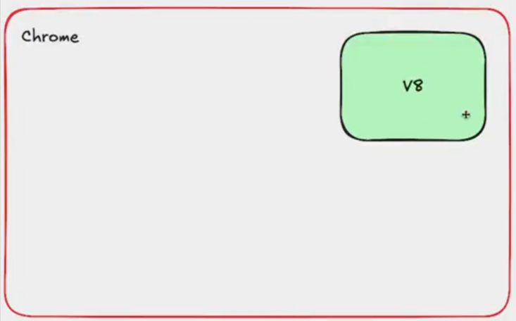

# 🌐 Node.js Notes

## 1. **What is Node.js?**
- A **JavaScript runtime environment**.
- Allows running JavaScript **outside the browser** (e.g., on servers).
- **Built on Chrome’s V8 JavaScript Engine**.
- Enables building fast, scalable network applications.


---

## 2. **Who Created Node.js and Why?**
- **Created by**: Ryan Dahl  
- **Released in**: 2009 (initial work started in 2007)
- **Reason**:
  - Traditional servers like **Apache** handled concurrent requests inefficiently.
  - Node.js was designed for **non-blocking**, event-driven, real-time applications.

  

---

## 3. **Installing Node.js**
- Download from [https://nodejs.org](https://nodejs.org)
- Choose:
  - **LTS (Long Term Support)**: Stable version recommended for most users.
  - **Current**: Latest features but less stable.

---

## 4. **Running JavaScript Files with Node**
- Use the terminal/command prompt:
  ```bash
  node filename.js
  ```
- Node provides its own runtime environment with built-in **APIs** like:
  - `fs` (file system)
  - `http` (server creation)
  - `path`, etc.

---

## 5. **Packages in Node.js**
- **Packages** are reusable libraries or tools.
- Installed using **npm (Node Package Manager)**.
- Example:
  ```bash
  npm install cat-me
  ```

---

## 6. **Packages vs Modules**
| Feature     | Package                           | Module                        |
|-------------|-----------------------------------|-------------------------------|
| Definition  | Third-party tools/libraries       | Built-in features in Node.js |
| Source      | Installed via `npm`               | Comes with Node.js            |
| Examples    | `express`, `cat-me`               | `http`, `fs`, `path`          |

---

## 7. **Installing and Using a Package (e.g., cat-me)**
- **Installation**:
  ```bash
  npm install cat-me
  ```
- **Usage** in your code:
  ```js
  const catMe = require("cat-me");
  console.log(catMe());
  ```

---

## 8. **HTTP Module in Node.js**
- Built-in module to **create servers**.
- No installation required.
- Enables handling **HTTP requests and responses**.

---

## 9. **Creating a Simple Server with HTTP Module**
```js
const http = require('http');

const server = http.createServer((req, res) => {
    res.end("Hello from Node.js server!");
});

server.listen(3000, () => {
    console.log("Server is running on port 3000");
});
```
